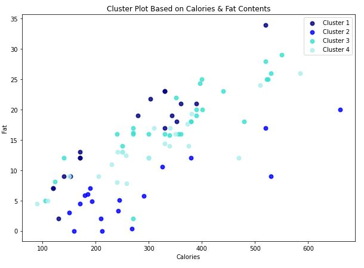
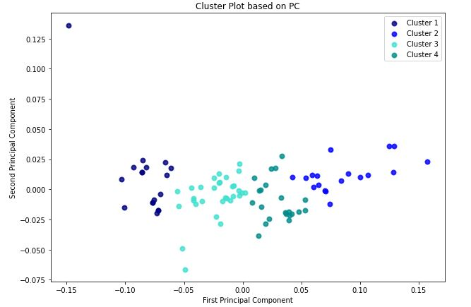
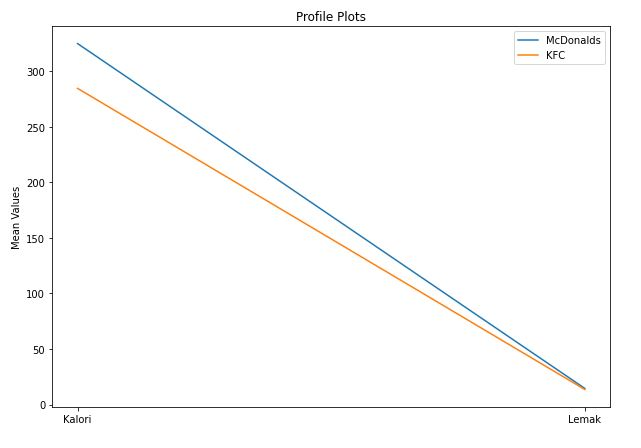

# Comparing Nutrition Facts of Menu in The Two Biggest Fast Food Restaurants in Indonesia : McDonalds and KFC

This is a final project of **Multivariate Analysis** course in my university. All of the code was done in Python, and it covered the topics of Clustering, Principal Component Analysis, T-Squared Hotelling's Test, and Profile Analysis. 

## Table of Contents 
[1. Introduction](#Intro)

[2. Clustering & Principal Component Analysis](#Clust)

[3. T-Squared Hotelling's Test and Profile Analysis](#Tsquared)

## Introduction

**About the Dataset**

The dataset used in this research is a result of scraping from a source (you can check the scraping code in the `scraping.py` file) that gives nutrition facts information of two well-known fast food restaurants in Indonesia, which are: McDonalds and KFC. There are information about total energy, calory, carbohidrate, protein, and fat of one portion of each menu at those restaurants. 

This dataset will be used to compare nutrition facts of McDonalds' menu and KFC's menu. The result of this analysis can be useful both for the consumers and restaurants' owners. For consumers, they can choose which menu from which restaurant are best suited with their preference of nutrition contents. On the other hand, for restaurants' owners, they can understand more about the nutrition contents of their menu and their competitor's menu and later on they can adjust their nutrition content in order to win the market competition.

**Variables Explanation**

There are a lot of nutrition content data from the site, but to do this research we will only use the complete data (doesn't containing null values), which are:
* `Energi` : energy got from eating one portion of each menu
* `Kalori` : calories content of one portion of each menu
* `Lemak` : fat content of one portion of each menu
* `Protein` : protein content of one portion of each menu
* `Karbohidrat` : carbohidrate content of one portion of each menu

## Clustering & Principal Component Analysis

**Research Purposes**

1. Cluster the menu of the two restaurants based on their nutrition facts.

2. Use dimensional reduction in order to see whether the projected new dimensions can create clear boundaries between the clusters.

**Statistical Methodologies**

1. **Hierarchical Agglomerative Method** to cluster the menu based on the nutrition facts. This method is chosen because the researcher doesn't have preference of the number of clusters. Dendrogram is used to determine the appropriate number of clusters.

2. **Principal Component Analysis** to do the dimensional reduction since all the variables are numerical variables. Scree Plot is used to determine the appropriate number of principal components to represent the original variables.

**Cluster Result Visualization using Calory and Fat**

**Cluster Result Visualization using Principal Components**

## T-Squared Hotelling's Test and Profile Analysis

**Research Purposes**

1. Compare the mean of calory and fat contents of menu in KFC and McDonalds, and see whether there is a significant difference.

2. Further analyze the difference between the mean of calory and fat contents of menu in KFC and McDonalds.

**Statistical Methodologies**

1. **T Square's Hotelling** to do the multivariate inference whether there is a significance difference between the calory and fat contents of menu in KFC and McDonalds. Since the assumption of this method is the data has to be multivariate normal distributed, **Mardia's Test** was used to test the assumption. In addition, **Levene Test** was used to determine whether the same or different sample variance assumption was used for this method.

2. **Profile Analysis** to further analyze the difference between calory and fat contents of menu in KFC and McDonalds.

**Profile Plot**

That's all the materials covered in this research. Feel free to contact me via LinkedIn if you have any questions or suggestions!
